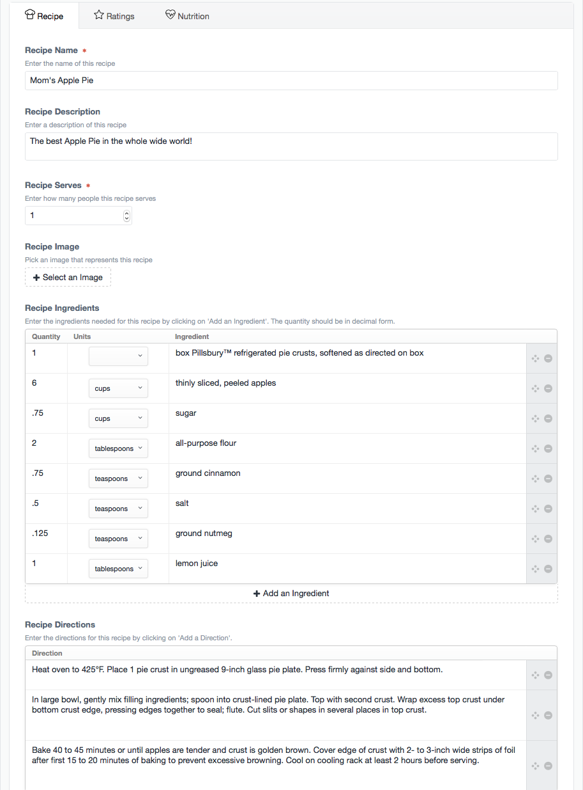
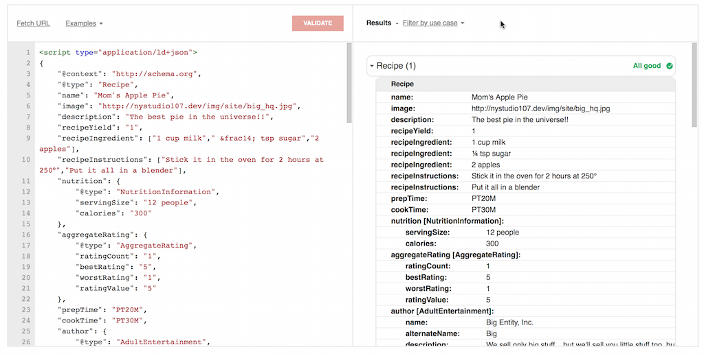

# DEPRECATED

This Craft CMS 2.x plugin is no longer supported, but it is fully functional, and you may continue to use it as you see fit. The license also allows you to fork it and make changes as needed for legacy support reasons.

The Craft CMS 3.x version of this plugin can be found here: [craft-recipe](https://github.com/nystudio107/craft-recipe) and can also be installed via the Craft Plugin Store in the Craft CP.

# Recipe plugin for Craft CMS

A recipe FieldType for Craft CMS that includes microdata support

Related: [Recipe for Craft 3.x](https://github.com/nystudio107/craft3-recipe)

## Installation

To install Recipe, follow these steps:

1. Download & unzip the file and place the `recipe` directory into your `craft/plugins` directory
2.  -OR- do a `git clone https://github.com/nystudio107/recipe.git` directly into your `craft/plugins` folder.  You can then update it with `git pull`
3.  -OR- install with Composer via `composer require nystudio107/recipe`
4. Install plugin in the Craft Control Panel under Settings > Plugins
5. The plugin folder should be named `recipe` for Craft to see it.  GitHub recently started appending `-master` (the branch name) to the name of the folder for zip file downloads.

Recipe works on Craft 2.4.x, Craft 2.5.x, and Craft 2.6.x.

## Recipe Overview

Recipe adds a 'Recipe' FieldType for Craft CMS that you can add to any of your Sections.

In encapsulates everything you need for a recipe, including the ingredients, a photo of the recipe, directions, cooking time, ratings, and even nutritional information. It handles converting between Imperial and Metric units, outputs 'pretty' fractions for Imperial units, and can output correct ingredient portions for any number of servings.

Recipe also generates the [JSON-LD microdata](https://developers.google.com/structured-data/) for your recipes if you have the [SEOmatic plugin](https://github.com/nystudio107/seomatic) installed, which allows it to be displayed in the [Google knowledge panel](https://developers.google.com/structured-data/rich-snippets/recipes) for search results.

We hope Recipe makes it easier for you to create and share some yummy recipes!

## Configuring Recipe

Create a Recipe field via **Settings->Fields** and you can set the Asset Sources that are used for the recipe images

## Using Recipe

Once you have created the Recipe field, add it to your Section Entry Types, and fill in what recipe information is appropriate.  Nothing other than the name is required, so feel free to leave anything blank that you're not using.

## Using Recipe in your Templates

To display information about a recipe in your templates, you just use familiar Twig code.  Let's assume the field handle for your Recipe field is `someRecipe`; this is what you'd use to output information about it:

### Basic Info

* `{{ entry.someRecipe.name }}` - the name of the recipe
* `{{ entry.someRecipe.description }}` - the description of the recipe
* `{{ entry.someRecipe.skill }}` - the skill level required to make this recipe
* `{{ entry.someRecipe.serves }}` - how many people the recipe serves
* `{{ entry.someRecipe.getImageUrl() }}` - a URL to the image for the recipe
* `{{ entry.someRecipe.prepTime }}` - the prep time for the recipe in minutes
* `{{ entry.someRecipe.cookTime }}` - the cooking time for the recipe in minutes
* `{{ entry.someRecipe.totalTime }}` - the total time for the recipe in minutes

### Ingredients

For a list of ingredients, do the following (adding whatever output markup you want):

    
    
        {{ ingredient }}
    

The first parameter is the units you'd like to use (`'imperial'` or `'metric'`).  The second parameter is how many people you'd like the recipe portions to be sized for.  By default, it will use `'imperial'` and the serving size in the recipe if you don't pass these parameters in, e.g.: `entry.someRecipe.getIngredients()`

### Directions

For a list of directions, do the following (adding whatever output markup you want):

    
    
        {{ direction }}
    

### Ratings

For a list of the ratings, do the following (adding whatever output markup you want):

    
    
        {{ rating.rating }} {{ rating.review }} {{ rating.author }}
    

For the aggregate (average) rating for this recipe, do the following (adding whatever output markup you want):

    {{ entry.someRecipe.getAggregateRating() }}

### Nutritional Information 

To output the nutritional information for the recipe, do the following:

* `{{ entry.someRecipe.servingSize }}` - The serving size, in terms of the number of volume or mass
* `{{ entry.someRecipe.calories }}` - The number of calories per serving
* `{{ entry.someRecipe.carbohydrateContent }}` - The number of grams of carbohydrates per serving
* `{{ entry.someRecipe.cholesterolContent }}` - The number of milligrams of cholesterol per serving
* `{{ entry.someRecipe.fatContent }}` - The number of grams of fat per serving
* `{{ entry.someRecipe.fiberContent }}` - The number of grams of fiber per serving
* `{{ entry.someRecipe.proteinContent }}` - The number of grams of protein per serving
* `{{ entry.someRecipe.saturatedFatContent }}` - The number of grams of saturated fat per serving
* `{{ entry.someRecipe.sodiumContent }}` - The number of milligrams of sodium per serving
* `{{ entry.someRecipe.sugarContent }}` - The number of grams of sugar per serving
* `{{ entry.someRecipe.transFatContent }}` - The number of grams of trans fat per serving
* `{{ entry.someRecipe.unsaturatedFatContent }}` - The number of grams of unsaturated fat per serving

### Image Asset ID

If you need to do any further manipulation of the Recipe Image (perhaps a transform) you can get the Asset ID for it:

* `{{ entry.someRecipe.imageId }}` - the Asset ID of the image for the recipe

## Rendering Recipe JSON-LD Microdata

If you have the [SEOmatic plugin](https://github.com/nystudio107/seomatic) installed, Recipe can render JSON-LD microdata for you, which allows it to be displayed in the [Google knowledge panel](https://developers.google.com/structured-data/rich-snippets/recipes) for search results:

	{{ entry.someRecipe.renderRecipeJSONLD() }}

## Recipe Roadmap

Some things to do, and ideas for potential features:

* Provide a front-end way to add ratings

## Recipe Changelog

### 1.0.3 -- 2017.01.05

* [Added] Added support for 1/3, 2/3, and 1/6 fractions
* [Improved] Updated the README.md

### 1.0.2 -- 2016.09.18

* [Fixed] Handle empty ingredients lists without erroring
* [Fixed] Handle empty directions without erroring
* [Improved] Updated the README.md

### 1.0.1 -- 2016.05.01

* [Fixed] Fixed a minor issue with Recipe if it was embedded in a Matrix field
* [Added] Added the 'Skill Level' field
* [Improved] Updated the README.md

### 1.0.0 -- 2016.05.01

* Initial release

Brought to you by [nystudio107](http://nystudio107.com)
